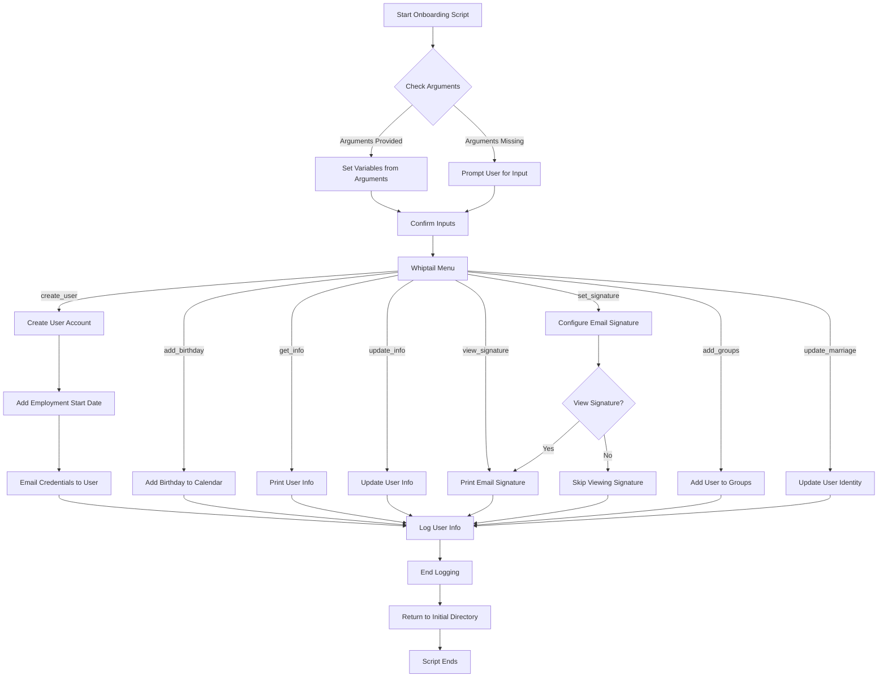
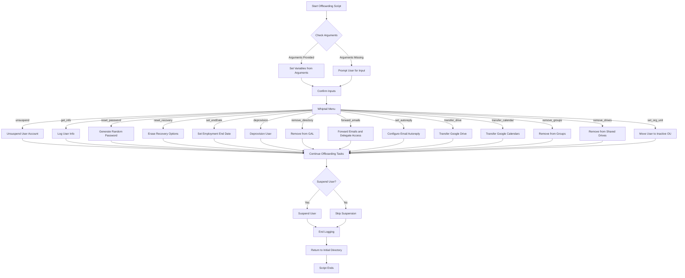

# GAM Google Workspace User Management Scripts

This repository offers Bash scripts that simplify user management in Google Workspace using GAM and GAMADV-XTD3 command-line tool, automating tasks like onboarding, offboarding, and updates for consistent and efficient administration.

## Prerequisites

1. **GAMADV-XTD3**: Ensure that GAMADV-XTD3 is installed and configured on your machine.
2. **Bash**: The scripts are designed to run in a Bash shell environment.

## Features

- **Onboarding Script (`onboard.sh`)**:

  - Creates new user accounts.
  - Sets up email signatures and group memberships.
  - Adds employment details and calendar events.

- **Offboarding Script (`offboard.sh`)**:

  - Resets passwords and clears recovery options.
  - Transfers Drive and Calendar data.
  - Configures email forwarding and auto-replies.
  - Removes users from groups and hides from the GAL.

- **Reporting Script (`print.sh`)**:
  - Generates various reports on users, groups, aliases, admins, calendars, and resources.

## Setup

1. **Install Dependencies**:
   Ensure that all required tools and dependencies are installed and updated. This includes GAM and GAMADV-XTD3, which can be installed using the following commands:

   ```bash
   bash <(curl -s -S -L https://gam-shortn.appspot.com/gam-install)
   bash <(curl -s -S -L https://raw.githubusercontent.com/taers232c/GAMADV-XTD3/master/src/gam-install.sh)
   ```

2. **Clone the Repository**:

   ```bash
   git clone https://github.com/grace-bible/GAM-boarding-scripts.git
   ```

3. **Configure `config.env`**:

   - Create a `config.env` file with necessary environment variables such as `GAM`, `GAM3`, `LOG_DIR`, `SIG_FILE`, `CC_HR`, `BDAY_CAL`, and `UPDATE_INTERVAL_DAYS`.

   ### Sample `config.env`

   ```bash
   # This is a configuration file for onboarding and offboarding scripts

   # Path to the GAM and GAMADV-XTD3 executable
   GAM=$HOME/bin/gam/gam
   GAM3=$HOME/bin/gamadv-xtd3/gam

   # Directory for storing logs
   LOG_DIR=/path/goes/here

   # Path to the email signature template file
   SIG_FILE=/path/goes/here

   TEMP_PASS=$(openssl rand -base64 12)

   # Email addresses to notify of onboarding
   CC_HR=hiring.manager@company.com

   # Your staff birthday calendar ID
   BDAY_CAL=your_calendar_id@group.calendar.google.com

   # Last update date for GAM and GAMADV-XTD3
   GAM_LAST_UPDATE="2000-01-01"

   # Update interval in days
   UPDATE_INTERVAL_DAYS=7
   ```

## Usage

### Onboarding Script

```bash
./onboard.sh (-h) [<onboard_first_name> <onboard_last_name> <onboard_user> <manager_email_address> <recovery_email> <campus> <job_title> <birthday>]
```

**Options**:

- `-h`: Print the help message.

**Arguments**:

1. `onboard_first_name`: User's first name.
2. `onboard_last_name`: User's last name.
3. `onboard_user`: New domain email for the user.
4. `manager_email_address`: User's manager email.
5. `recovery_email`: Personal email for the onboarding user.
6. `campus`: Assigned campus (AND, SW, CRK, MT, SYS).
7. `job_title`: User's official job title (optional).
8. `birthday`: User's birthday (YYYY-MM-DD) for the company birthday calendar (optional).

**`onboard.sh` Script Flowchart**:



### Offboarding Script

```bash
./offboard.sh (-h) [<offboard_user> <receiving_user>]
```

**Options**:

- `-h`: Print the help message.

**Arguments**:

1. `offboard_user`: User email for the offboarding user.
2. `receiving_user`: User email for the receiving user of any transfers.

**`offboard.sh` Script Flowchart**:



### Reporting Script

```bash
./print.sh
```

### Detailed Steps for Onboarding

1. **Create User**:

   - Sets a temporary password and notifies the user and HR.
   - Sets the employment start date and adds the user's birthday to the company calendar.

2. **Set Signature**:

   - Configures the user's email signature based on a template.

3. **Add Groups**:
   - Adds the user to specified groups with appropriate permissions.

### Detailed Steps for Offboarding

1. **Get Info**:

   - Logs the user's information for audit purposes.

2. **Reset Password and Recovery Options**:

   - Generates a random password and clears recovery options.

3. **Deprovision**:

   - Disables services and clears access tokens.

4. **Transfer Data**:

   - Transfers the user's Drive and Calendar data to another user.

5. **Set Auto-Reply and Forwarding**:

   - Configures an autoreply message and forwards incoming emails.

6. **Suspend User**:
   - Suspends the user account after all other steps are complete.

## Notes

- Both onboarding and offboarding scripts include interactive whiptail menus for selecting and executing tasks.
- Ensure that `config.env` is correctly configured with all required paths and settings.
- Review and test the scripts in a controlled environment before deploying them in production.
- Both scripts will regularly check for updates to GAM and GAMADV-XTD3 to ensure compatibility with the latest Google Workspace APIs.
- Feel free to submit issues and pull requests to improve functionality and compatibility.

## License

This project is licensed under the MIT License.
